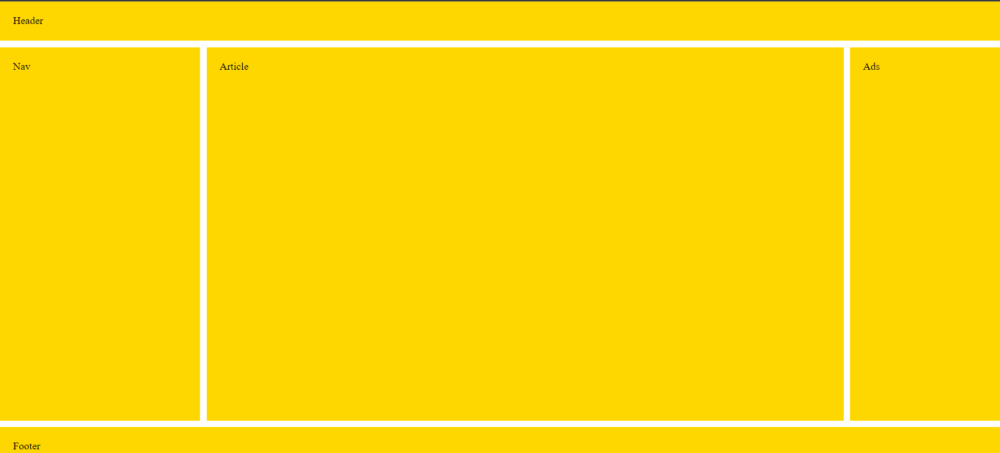

# Ex-04-Create-a-Web-Layout-using-GridBOX
## Aim:-
To Create a Web Layout using GridBOX
## Algorithm:-
### Step 1: 
Set up the HTML structure
### Step 2: 
Apply Grid properties
### Step 3: 
Customize and expand the layout
### Step 4:
Web layout created using CSS Grid.
### Step 5:
Publish Web layout created using CSS Grid
## Program:-
```html
<!doctype html>
<title>Example</title>
<style>
body { 
  display: grid;
  grid-template-areas: 
    "header header header"
    "nav article ads"
    "footer footer footer";
  grid-template-rows: 60px 1fr 60px;
  grid-template-columns: 20% 1fr 15%;
  grid-gap: 10px;
  height: 100vh;
  margin: 0;
  }
header, footer, article, nav, div {
  padding: 20px;
  background: gold;
}
#pageHeader {
  grid-area: header;
}
#pageFooter {
  grid-area: footer;
}
#mainArticle { 
  grid-area: article;      
  }
#mainNav { 
  grid-area: nav; 
  }
#siteAds { 
  grid-area: ads; 
  }
</style>
<body>
  <header id="pageHeader">Header</header>
  <article id="mainArticle">Article</article>
  <nav id="mainNav">Nav</nav>
  <div id="siteAds">Ads</div>
  <footer id="pageFooter">Footer</footer>
</body>
```
## Output:-

## Result:-
Thus the Program To Created a Web Layout using GridBOX